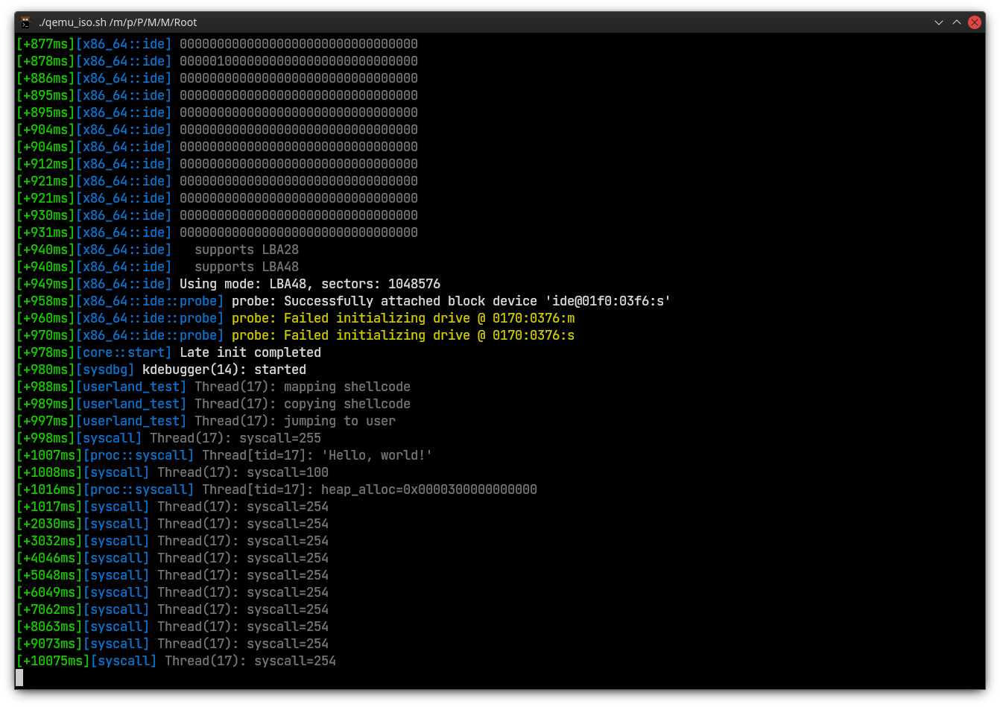

## MuOS

A work-in-progress OS (currently more kernel than OS) for x86_64.

*Barely-a-demo image of what the kernel is currently capable of*

### Documentation

Latest build of the documentation is available [here](https://muos.muzuwi.dev/).
Build instructions and development setup guide can be found there.

### Requirements

- Relatively recent x86 CPU

